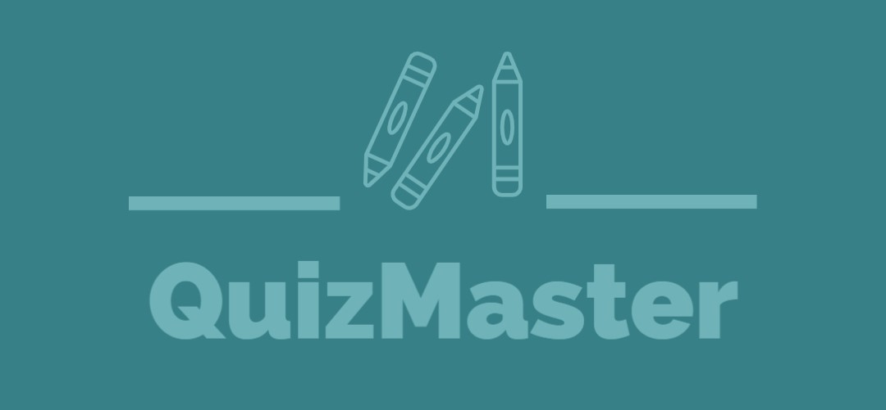

<h1 align="center">
    QuizMaster
</h1>

<p align="center">
Team Fun | Software Systems Capstone Project 
</p>

<div align="center">

     

</div> 

<div align="center">

 

</div>

<div align="center">

[](https://github.com/QuizMasterInc/QuizMaster/actions/workflows/prod.yml) 
[](https://github.com/QuizMasterInc/QuizMaster/actions/workflows/testing.yml)

</div>

<div align="center">
    
</div>

<h4 align="center">
Our capstone project that allows users to take quizzes on a variety of different topics. 
</h4>

## Development Team (ScramJets)
<div>
<h4>Alex Kaminski</h4> 

[](mailto:alexmkaminski@lewisu.edu)[](https://github.com/alexk0918)
</div>
<div>
<h4>James Mackowiak</h4> 

[](mailto:jamesvmackowiak@lewisu.edu)[](https://github.com/JamesMackowiak)
</div>
<div>
<h4>Hamzeh Albaz</h4> 

[](mailto:hamzehoalbaz@lewisu.edu)[](https://github.com/halbaz)
</div>
<div>
<h4>Alex Hernandez</h4> 

[](mailto:alexhernandez@lewisu.edu)[](https://github.com/alexh1424)
</div>
<div>
<h4>Evan Hartke</h4> 

[](mailto:evanmhartke@lewisu.edu)[](https://github.com/raxtt)
</div>

## Development Team (Team Fun)
<div>
<h4>Anthony Mastores</h4> 

[](mailto:anthonyjmastores@lewisu.edu)[](https://github.com/AnthonyMastores)
</div>
<div>
<h4>Maximus Lewis</h4> 

[](mailto:maximusslewis@lewisu.edu)[](https://github.com/mslew)
</div>
<div>
<h4>Matthew Espinos</h4>  

[](mailto:matthewwespinos@lewisu.edu)[](https://github.com/MattEspinos)
</div>
<div>
<h4>Matthew Senese</h4> 

[](mailto:matthewjsenese@lewisu.edu)[](https://github.com/MatthewSenese)
</div>
<div>
<h4>Tyler Zenisek</h4> 

[](mailto:tylerzenisek@lewis.edu)[](https://github.com/tzenisekj)
</div>
<div>
<h4>Jahi Stewart</h4> 

[](mailto:jahikstewart@lewis.edu)[](https://github.com/JahiStewart)
</div>
<div>
<h4>Jose Montes De Oca Morfin</h4> 

[](mailto:joseamontesdeocamo@lewisu.edu)[](https://github.com/JoseMDO)
</div>
<div>
<h4>Julie Dosher</h4> 

[](mailto:juliegdosher@lewisu.edu)[](https://github.com/juliedosher)
</div>

## Development Team (ChairForceOne)
<div>
<h4>Daniel Jazowski</h4> 

[](mailto:danieljjazowski@lewisu.edu)[](https://github.com/dj1178)
</div>
<div>
<h4>Brian Gutt</h4> 

[](mailto:brianmgutt@lewisu.edu)[](https://github.com/briang38)
</div>
<div>
<h4>Hima Madhavan</h4> 

[](mailto:himajmadhavan@lewisu.edu)[](https://github.com/hmadhavann)
</div>
<div>
<h4>Jayrell Garcia</h4> 

[](mailto:jayrellgarcia@lewisu.edu)[](https://github.com/jayrellg)
</div>
<div>
<h4>Ahmad Yousuf</h4> 

[](mailto:ahmadoyousuf@lewisu.edu)[](https://github.com/ahmadyousuf03)
</div>


## Installation and Setup
1. Install Firebase CLI 
```sh
npm install -g firebase-tools
```
2. Login to Firebase
```sh
firebase login
```
3. Install Dependencies
```sh
npm install
```

## Building and Running for Production
1. Running a local build
```sh
npm run dev
```

2. Running a Firebase Emulator
```sh
firebase emualators:start
```

3. Build the Project
```sh
npm run build
```

## Process
Find the process and CI/CD configuration file [here](PROCESS.md).

## Minimum Viable Product
Find our Minimum Viable Product (MVP) [here](MVP.md).

## Team
Find team information [here](TEAM.md).
